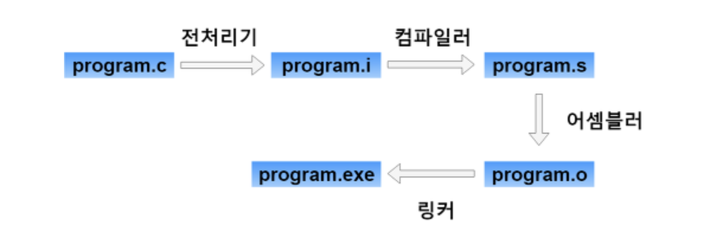

# Program Compile Process

전처리기(Preprocessor) : 전처리기 구문(#으로 시작하는 구문)을 처리하는 것

컴파일러(Compiler) : 이제 전처리기를 거쳤으니 컴파일러로 컴파일해줍니다. 컴파일러는 고수준언어를 저수준언어로 나타내는 역할을 수행합니다. 저수준언어라는 것은 기계어와 가장 가까운 언어입니다.

어셈블러(Assembler) : 이제 완전히 기계어로 바꾸어 주는 역할을 합니다.

**링커(Linker) :** 링커는 이름이 말해주듯 연결해주는 역할을 합니다. 여러개의 오브젝트파일을 하나로 합치거나 라이브러리를 합칠때 링커가 필요하다는 거지요.