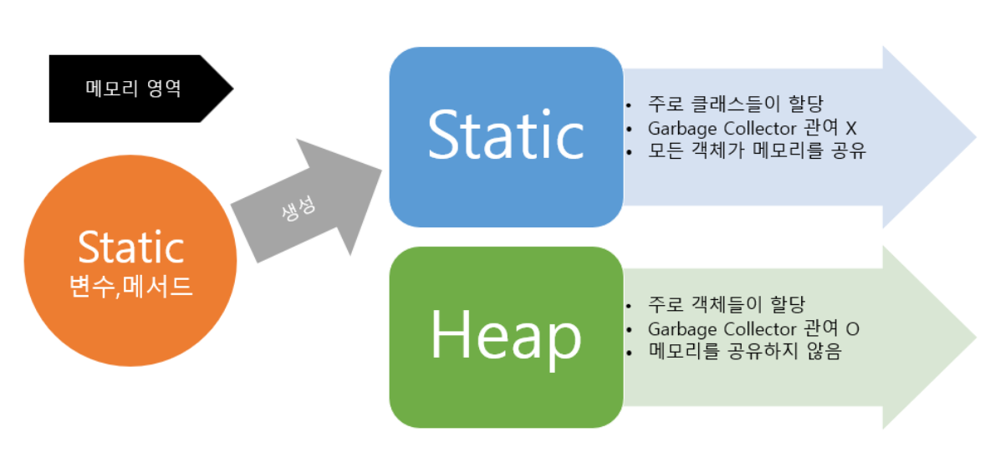

# static 

클래스 로더가 클래스를 불러와 메소드 메모리 영역에 로드하면 클래스별로 관리됩니다.

- static 키워드를 통해 생성된 정적 멤버는 힙 영역이 아닌 정적 영역에 할당됩니다.

- 따라서 하나의 멤버가 어디에서나 참조될 수 있도록 모든 개체에서 공유됩니다.

- 하지만 Garbage Collector의 관리 영역 밖에 있기 때문에 프로그램이 종료될 때까지 할당된 메모리가 남아 있습니다.

- 따라서 static을 너무 많이 사용하면 성능에 악영향을 미칩니다.

