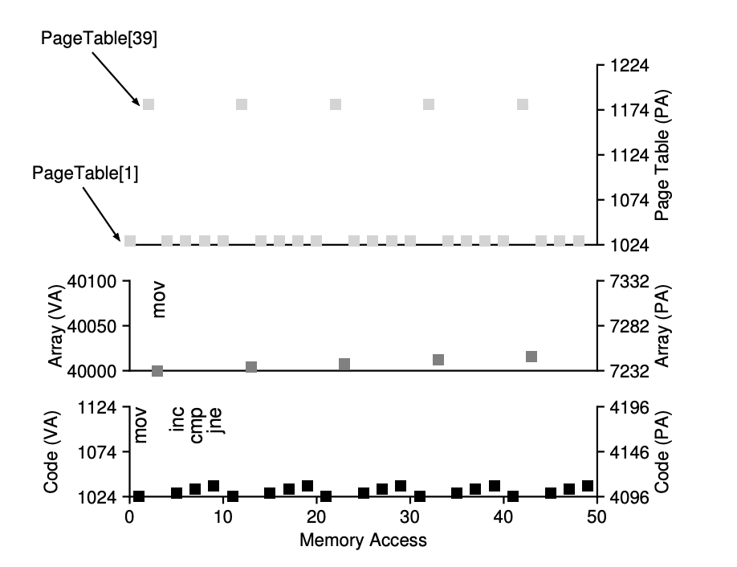
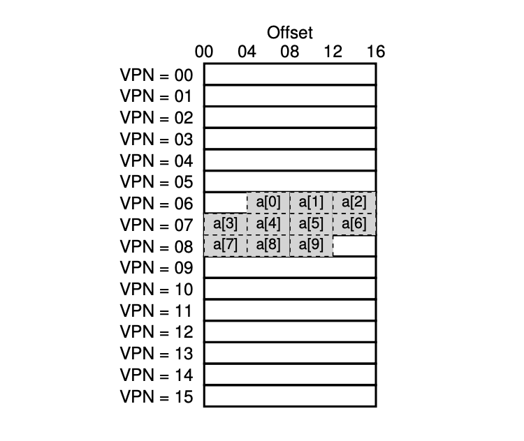

PDF: [Operating Systems: Three Easy Pieces](https://pages.cs.wisc.edu/~remzi/OSTEP/)

- [주소 공간 (address space)](#주소-공간-address-space)
- [주소 변환 (address translation)](#주소-변환-address-translation)
- [17. 세그멘테이션](#17-세그멘테이션)
- [18. 페이징: 개요](#18-페이징-개요)
  - [페이지 테이블](#페이지-테이블)
  - [예시](#예시)
  - [페이지 테이블이 저장되는 곳](#페이지-테이블이-저장되는-곳)
  - [페이지 테이블의 구성](#페이지-테이블의-구성)
    - [선형 페이지 테이블](#선형-페이지-테이블)
  - [페이징: 너무 느림](#페이징-너무-느림)
    - [각 메모리 참조 시 일어나느 세부 동작](#각-메모리-참조-시-일어나느-세부-동작)
  - [메모리 트레이스](#메모리-트레이스)
- [19. 페이징: 더 빠른 변환 (TLB)](#19-페이징-더-빠른-변환-tlb)
  - [TLB 제어 흐름 알고리즘](#tlb-제어-흐름-알고리즘)
  - [예제: 배열 접근](#예제-배열-접근)
    - [지역성](#지역성)
  - [TLB 미스의 처리](#tlb-미스의-처리)
    - [CISC(complex-instruction set computers)](#cisccomplex-instruction-set-computers)
    - [RISC(reduced instruction set computing)](#riscreduced-instruction-set-computing)
- [20. 페이징: 더 작은 테이블](#20-페이징-더-작은-테이블)

## 주소 공간 (address space)

프로세스마다 각각의 메모리 공간이 별개로 할당된다.
protection을 위해 address space를 만든다.

## 주소 변환 (address translation)

MMU(memmory management unit)같은 하드웨어를 통해 이루어진다.

- 챗지피티 질문
  - 설명이 부족한 문장을 더 길게 채워주되, 너무 복잡하게 되게끔 하지는마.
  - 다른 사람도 알아보기 쉽게해줘

## 17. 세그멘테이션

## 18. 페이징: 개요

프로세스의 주소 공간을 몇 개의 가변 논리 세그먼트로 나누는 것이 아니라 고정 크기의 단위로 나눈다. 이 각각의 고정 크기의 단위를 **페이지(page)** 라고 부른다.

### 페이지 테이블

- 주소 공간의 각 가상 페이지에 대한 물리 메모리 위치 기록을 위하여 운영체제는 프로세스 마다
  **페이지 테이블(page table)** 이라는 자료구조를 유지한다.

- 페이지 테이블의 주요역할: 가상 페이지 **주소 변환(address translation)** 정보를 저장한다. 각 페이지가 저장된 물리 메모리의 위치를 알려준다.

- 페이지 테이블은 프로세스마다 존재한다.

### 예시

```assembly
movl <virtual address>, %eax
```

주소 `<virtual address>`의 데이터를 eax 레지스터에 탑재

1. 프로세스가 생성한 가상 주소의 변환을 위해 먼저 가상 주소를 **가상 페이지 번호(virtual page number, VPN)** 와 페이지 내의 **오프셋** 2개의 구성요소로 분할한다.

2. 프로세스가 가상 주소를 생성하면 운영체제와 하드웨어가 의미있는 물리 주소로 변환한다.

```assembly
movl 21, %eax
```

- 21을 이진 형식으로 변환하면 "010101"을 얻는다.
- 이 가상 주소를 검사하고 가상 페이지 번호와 오프셋으로 나눈다.
  > 가상 주소 "21"은 가상 페이지 "01"(또는 1)의 5번째("0101"번째) 바이트이다.
- 이 가상 페이지 번호를 가지고 페이지 테이블의 인덱스로 사용하여 가상페이지 1이 어느 물리 프레임에 저장되어 있는지 찾을 수 있다.
- 위의 페이지 테이블에서 **물리 프레임 번호(physical frame number, PFN)** 는 7(111)이다 (예시로)
- VPN을 PFN으로 교체하여 가상 주소를 변환 할 수 있다. 그런 후에 물리 메모리에 탑재 명령어를 실행한다.
  - "01 0101" -> "111 0101" (이때 오프셋은 동일하다)
- 최종적으로 계산된 물리 주소는 "1110101"(십진수 117)이며, 이곳이 탑재할 데이터가 저장된 정확한 위치이다.

### 페이지 테이블이 저장되는 곳

페이지 테이블은 매우 커질 수 있기 때문에 현재 실행 중인 프로세스 페이지 테이블을 저장 할 수 있는 회로를 MMU안에 저장 하지 않는다. 대신 각 프로세스의 페이지 테이블을 메모리에 저장한다.

### 페이지 테이블의 구성

#### 선형 페이지 테이블

운영체제는 원하는 물리 프레임 번호(PFN)를 찾기 위해서 가상 페이지 번호(VPN)로 배열의 항목에 접근하고 그 항목의 페이지 테이블 항목(PTE)을 검색한다.

각 PTE에는 심도있는 이해가 필요한 비트들이 존재한다.

- Valid bit: 특정 변환의 유효 여부를 나타내기 위하여 포함된다.
  - 프로그램이 실행을 시작할 때 코드와 힙이 주소 공간의 한쪽에 있고 반대쪽은 스택이 차지하고 있을 것이다. 그 사이의 모든 미사용 공간은 무효(invalid)로 표시되고, 프로세스가 그런 메모리를 접근하려고 하면 운영체제에 트랩을 발생시킨다.
  - 주소 공간의 미사용 페이지를 모두 표시함으로써 이러한 페이지들에게 물리 프레임을 할당할 필요를 없애 대량의 메모리를 절약한다.
- Potection bit: 페이지가 읽을 수 있는지, 쓸 수 있는지, 또는 실행 될 수 있는지를 표시한다.
  - protection bit가 허용하지 않는 방식으로 페이지에 접근하려고 하면 운영체제에서 트랩을 생성한다.
- Present bit: 이 페이지가 물리 메모리에 있는지 혹은 디스크에 있는지(즉, 스왑 아웃되었는지) 가리킨다.
  - 스와핑은 운영체제가 드물게 사용되는 페이지를 디스크로 이동시켜 물리 메모리를 비울 수 있게 한다.
- Dirty bit: 메모리에 반입된 후 페이지가 변경되었는지 여부를 나타낸다.
- Reference bit: 페이지가 접근되었는지를 추적하기 위해 사용한다.

### 페이징: 너무 느림

페이지 테이블의 크기가 메모리상에서 매우 크게 증가할 수 있다. 이로 인해 처리 속도가 저할 될 수 있다.

```assembly
movl 21, %eax
```

주소 21에 대한 참조만 고려하고 명령어 반입에 대해서는 고려하지 않기로 한다.
이 예에서 하드웨어가 주소 변환을 담당한다고 가정한다.

원하는 데이터를 가져오기 위해서 먼저 시스템은 가상 주소(21)을 정확한 물리 주소(117)로 변환해야 한다. 주소 117에서 데이터를 반입하기 전에 시스템은 프로세스의 페이지 테이블에서 적절한 페이지 테이블 항목을 가져와야 하고, 변환을 수행한 후, 물리 메모리에서 데이터를 탑재한다. 이를 위해서 하드웨어는 현재 실행 중인 프로세스의 페이지 테이블의 위치를 알아야 한다. 원하는 PTE의 위치를 찾기 위해 하드웨어는 다음과 같은 연산을 수행한다.

```
VPN = (VirtualAddress & VPN_MASK) >> SHIFT
PTEAddr = PageTableBaseRegister + (VPN * seizof(PTE))
```

이 예제에서 VPN_MASK는 0x30(16진수 30 또는 이진수 110000)으로 설정되고, 전체 가상 주소에서 VPN 비트만 골라낸다. SHIFT는 4로 설정되고(오프셋 비트 수), 올바른 정수 가상 페이지 번호를 형성하기 위해 VPN 비트를 오른쪽으로 이동시킨다.

- 가상 주소 21(010101)을 마스킹하면 010000이 되고,
- 우측 방향으로 비트를 이동시켜 01 또는 우리가 원하는 가상 페이지 1로 변환한다.

이 값을 페이지 테이블 베이스 레지스터가 가리지는 PTE 배열에 대한 인덱스로 사용한다.

```
offset = VirtualAddress & OFFSET_MASK
PhysAddr = (PFN << SHIFT) | offset
```

이 물리주소가 알려지면 하드웨어는 메모리에서 PTE를 반입할 수 있고, PFN을 추출하고 가상 주소의 오프셋과 연결하여 원하는 물리 주소를 만들 수 있다.

마지막으로, 하드웨어는 메모리에서 원하는 데이터를 가져와서 eax 레지스터에 넣을 수 있다.
이제 프로그램은 메모리로부터 값을 성공적으로 탑재하였다.

#### 각 메모리 참조 시 일어나느 세부 동작

```
1 // 가상 주소에서 VPN 추출
2 VPN = (VirtualAddress & VPN_MASK) >> SHIFT
3 // 페이지 테이블 항목 (PTE) 의 주소 형성
4 PIEAddr = PTBR + (VPN * SiZeOE (PTE))
5 // PTE 반입
6 PIE = AccessMemory (PTEAddr)
7 // 프로세스가 페이지를 접근할 수 있는지 확인
8 if (PTE. Valid == False)
9     RaiseException (SEGMENTATION _FAULT)
10 else if (CanAccess (PTE.ProtectBits) == False)
11    RaiseException (PROTECTION_FAULT)
12 else
13    //접근 가능하면 물리 주소 만들고 값 가져오기
14    offset = VirtualAddress & OFFSET_MASK
15    PhysAddr = (PTE.PFN << PFN_SHIFT) | offset
16    Register = AccessMemory (PhysAddr)
```

- 모든 메모리 참조에 대해 먼저 페이지 테이블에서 변환 정보를 반입해야 하기 때문에 반드시 한번의 추가적인 메모리 참조가 필요하다.
- 메모리 참조는 비용이 비싸고 이 경우에 프로세스는 2배 이상 느려진다.

결론: **하드웨어와 소프트웨어의 신중한 설계 없이는 페이지 테이블로 인해 시스템이 매우 느려질 수 있으며 너무 많은 메모리를 차지한다.**

### 메모리 트레이스

```c
int array[1000];
...
for (int i = 0; i < 1000; i++)
  array[i] = 0;
```

우리는 array.c를 컴파일하고 다음과 같이 실행한다.

```shell
prompt> gcc -o array array.c -Wall -O
prompt> ./array
```

array.c의 어셈블리 코드

```assembly
1024 movl $0x0, (%edi, %eax, 4)
1028 incl %eax
102c cmp1 $0x03e8,%eax
1030 jne 0x1024
```

위 코드는 x86 어셈블리어로 작성된 코드로서, 주소 계산과 메모리 초기화 기능을 수행하는 반복문으로 구성되어 있습니다.

1. `movl $0x0, (%edi, %eax, 4)` 구문은 `%eax` 레지스터와 4를 곱한 값에 `%edi` 레지스터의 값(주소)을 더한 주소에 0을 저장합니다. 이는 0으로 초기화된 4바이트 워드를 메모리에 저장하는 기능을 합니다.

2. `incl %eax` 구문은 `%eax` 레지스터의 값을 1 증가시킵니다. 이는 다음에 초기화할 메모리 위치의 주소를 계산하기 위한 용도입니다.

3. `cmp1 $0x03e8,%eax` 구문은 `%eax` 레지스터의 값이 1000(0x03e8)인지 비교합니다. 만약 같지 않으면, `jne 0x1024` 구문으로 인해 반복문의 시작점으로 점프하여 다시 초기화를 수행합니다. 이는 1000개의 워드를 초기화할 때까지 계속 반복하는 기능을 합니다.

따라서, 이 코드는 `%edi`가 가리키는 메모리 위치부터 0으로 초기화된 1000개의 4바이트 워드를 만드는 기능을 수행합니다.

이 명령어 시퀀스가 어떤 메모리 접근을 생성하는지 이해하기 위해서는 몇가지 가정이 필요하다.

```
- 64KB의 가상 주소 공간을 가정한다.
- 페이지의 크기는 1KB로 가정한다.
- 선형 페이지 테이블이고 물리 주소 1KB(1024)에 위치한다고 가정한다.
- 페이지 크기가 1KB(1024)이기 때문에 가상 주소 1024는 가상 주소 공간의 두번째 페이지(VPN=1)에 상주한다.(VP=0이 첫번째 페이지이기 때문에)
- 이 가상 페이지가 물리 프레임(4)에 매핑된다고 가정하자(VPN 1 -> PFN 4)
- 배열 자체의 크기는 4000바이트(1000개의 정수)이고, 가상 주소 40000에서 44000까지 존재한다고 가정한다.
- 이 범위에 해당하는 가상페이지는 VPN = 39 ... VPN = 42이다.
- 가상-대-물리 주소 매핑이 다음과 같다고 가정한다.
  - (VPN 39 -> PFN 7), (VPN 40 -> PFN 8), (VPN 41 -> PFN 9), (VPN 42 -> PFN 10)
```

프로그램이 실행되면 명령어 반입 시에 메모리가 두번 참조된다.

1. 명령어 위치 파악을 위한 페이지 테이블 접근
2. 명령어 자체에 한번

추가적으로 mov 명령어는 메모리 참조를 한번 한다.

처음 다섯번의 루프 반복에 대한 전체과정


- 가상 주소가 좌측 Y축, 물리 주소가 우측 Y축
- 가장 아래 그래프가 명령어 메모리 참조
- 중앙의 그래프는 배열에 대한 접근
- 맨 위의 그래프는 테이블 메모리 접근

루프당 10번의 메모리 접근이 존재한다.

- 네번의 명령어 반입과 한번의 메모리 갱신
- 이러한 네번의 반입과 한번의 메모리 갱신을 위한 주소 변환을 위한 총 다섯번의 페이지 테이블 접근

## 19. 페이징: 더 빠른 변환 (TLB)

운영체제의 실행 속도를 개선하기 위해서 하드웨어의 도움을 받는다.

**TLB**: 변환-색인 버퍼(translation-lookside buffer)

- 칩의 메모리 관리부(memory-management unit, MMU)의 일부다.
- 자주 참조되는 가상 주소-실주소 변환 정보를 저장하는 하드웨어 캐시이다.

가상 메모리 참조시, 하드웨어는 먼저 TLB에 원하는 변환 정보가 있는지를 확인한다. 만약 있다면 페이지 테이블을 통하지 않고 변환을 빠르게 수행한다.

### TLB 제어 흐름 알고리즘

```
1 VPN = (VirtualAddress & VPN_MASK) >> SHIFT
2 (Success, TlbEntry) = TLB_Lookup(VPN)
3 if (Success == True) // TLB Hit
4     if (CanAccess(TlbEntry.ProtectBits) == True)
5         Offset = VirtualAddress & OFFSET_MASK
6         PhysAddr = (TlbEntry.PFN << SHIFT) | Offset
7         Register = AccessMemory(PhysAddr)
8     else
9         RaiseException(PROTECTION_FAULT)
10 else // TLB Miss
11    PTEAddr = PTBR + (VPN * sizeof(PTE))
12    PTE = AccessMemory(PTEAddr)
13    if (PTE.Valid == False)
14        RaiseException(SEGMENTATION_FAULT)
15    else if (CanAccess(PTE.ProtectBits) == False)
16        RaiseException(PROTECTION_FAULT)
17    else
18        TLB_Insert(VPN, PTE.PFN, PTE.ProtectBits)
19        RetryInstruction()
```

1번라인. 가상 페이지 번호(VPN)을 추출한다.

2번라인. 해당 VPN의 존재 여부를 검사한다.

- 만약 존재하면 **TLB 히트** 이고 TLB가 변환 값을 갖고 있다는 것을 뜻한다.
- 이제 해당 TLB 항목에서 페이지 프레임 번호(PFN)를 추출할 수 있다.

4번라인. 해당 페이지에 대한 접근 권한 검사가 성공하면

5~7번라인. 그 정보 를 원래 가상주소의 오프셋과 합쳐서 원하는 물리 주소(PA)를 구성하고 메모리에 접근 할 수 있다.

**TLB 미스**인 경우에는 할일이 많다.

11~12번 라인. 하드웨어가 변환 정보를 찾기 위해서 페이지 테이블에 접근하며

13~15번 라인. 프로세스가 생성한 가상 메모리 참조가 유효하고 접근 가능하다면

18번 라인. 해당 정보를 TLB로 읽어들인다.

- 이는 매우 시간이 많이 소요되는 작업이다. 페이지 테이블 접근을 위한 12번 라인의 메모리 참조 때문이다.
- 메모리 접근 연산은 다른 CPU연산(예, 덧셈, 곱셈 등)에 비해 매우 시간이 오래 걸린다.
- TLB 미스가 많이 발생할수록 메모리 접근 횟수가 많아진다.

### 예제: 배열 접근

- 가상 주소 100번지의 10개의 4바이트 크기의 정수 배열이 존재한다.
- 가상 주소 공간은 8비트이며, 페이지의 크기는 16바이트이다.
- 가상 주소는 4비트 VPN(16개의 가상 페이지들)과 4비트 오프셋(각 페이지는 16바이트 크기)



```c
int sum = 0;
for (int i = 0; i < 10; i++){
  sum += a[i];
}
```

1. 첫 번째 배열의 항목(a[0])이 접근된다. 가상 주소 100번이다.
2. 하드웨어는 VPN을 추출한다. VPN이 06번이다.
3. 하드웨어는 TLB에서 해당 VPN을 검색한다.
   - TLB가 완전히 초기화되어 있다 가정하자.
4. TLB 미스가 발생한다.
   - 미스가 발생하면 해당 VPN 06번에 대한 물리 페이지 번호를 찾아, TLB를 갱신한다.
5. 다음은 a[1]를 읽는다. a[1]을 읽을 때는 TLB히트다.
   - 배열의 두번째 항목은 첫번째 항목과 같은 페이지에 존재한다.
   - 첫번째 항목을 읽을 때, 이미 해당 페이지를 접근하였기 때문에, 필요한 변환 정보가 이미 TLB에 탑재되어 있다.
   - a[2]를 읽을 때에도 같은 상황이다.
6. 같은 상황으로 a[3]과 a[7]를 읽을 때도 미스가 발생한다.

이 예제에서 보는 바와 같이 **페이지의 크기** 는 TLB의 효용성에 매우 중요한 역할을 한다.

페이지의 크기가 두배가 되면, TLB의 미스 횟수가 더 줄어든다.

#### 지역성

1. 시간 지역성(temporal locality): 최근에 접근된 명령어 또는 데이터는 곧 다시 접근될 확률이 높다는 사실에 근거한다.
   - for문이나 while문 같은 경우 일정시간 동안 반복적으로 접근된다.
2. 공간 지역성(spatial locality): 프로그램이 메모리 주소 x를 읽거나 쓰면, x와 인접한 메모리 주소를 접근할 확률이 높다는 사실에 근거한다.
   - 배열을 순차적으로 읽는 프로그램이 공간 지역성을 갖는 대표적인 예이다.

### TLB 미스의 처리

크게 두가지 방법이 있다. 하드웨어와 소프트웨어(운영체제)이다.

#### CISC(complex-instruction set computers)

미스 발생시 **하드웨어**는 다음과 같은 일을 한다:

1. 페이지 테이블에서 원하는 페이지 테이블 엔트리를 찾고,
2. 필요한 변환 정보를 추출하여,
3. TLB를 갱신한 후,
4. TLB 미스가 발생한 명령어를 재실행한다.

> 대표적인 예) 인텔 x86 CPU(하드웨어로 관리되는 TLB)

#### RISC(reduced instruction set computing)

- CISC 보다 최근에 등장한 컴퓨터 구조이다.

- RISC 기반 컴퓨터는 소프트웨어 관리 TLB를 사용한다.

- RISC 기반 컴퓨터에서 TLB 미스를 처리하는 과정은 다음과 같다.
  - TLB에서 주소 찾는 것이 실패하면 하드웨어는 예외 시그널을 발생시킨다.
  - 예외 시그널을 받은 운영체제는 명령어 실행을 잠정 중지하고, 실행 모드를 커널모드로 변경하여, 커널 코드 실행을 준비한다.
    - 이때 핵심은 커널 주소 공간을 접근할 수 있도록 특권 레벨(privilege level로) 상향 조정하는 것이다.
  - 커널 모드로 변경이 되면 트랩 핸들러를 실행한다.
    - 이때 실행되는 트랩핸들러는 TLB 미스의 처리를 담당하는 운영체제 코드이다.
  - 이 트랩 핸들러는 페이지 테이블을 검색하여 변환 정보를 찾고, TLB 접근이 가능한 특권 명령어를 사용하여 TLB를 갱신한 후에 리턴한다.
  - 트랩 핸들러에서 리턴되면 하드웨어가 명령어를 재실행한다.
    - 트랩 핸들러가 TLB를 갱신했으므로 이제는 TLB 히트가 날 것이다.

## 20. 페이징: 더 작은 테이블
