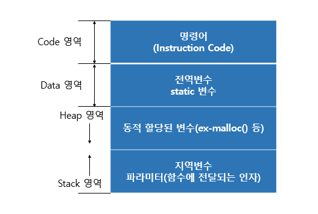
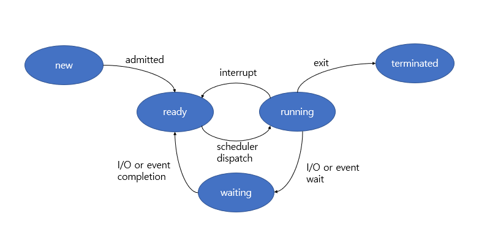

# 프로세스란?
실행 중인 프로그램을 뜻합니다.

프로그램은 명령어들의 모음을 포함한 디스크에 저장된 파일

## 프로세스의 메모리 구조

- Code 영역: 프로그램을 실행시키는 실행 파일 내의 명령어들이 위치하는 공간
- Data 영역: 전역변수, static 변수들이 위치하는 공간
- Heap 영역: 동적할당을 위한 메모리 영역(malloc, new 등)
- Stack 영역: 지역 변수, 파라미터(함수에 전달되는 인자)가 위치하는 공간

## 프로세스 상태

- new : 프로세스가 생성된 상태입니다. OS 커널에 존재하는 Ready queue에 올라가면 ready 상태가 됩니다.

- ready : 프로세스가 CPU로부터 메모리 공간을 할당받길 기다리는 상태입니다. 이때 프로세스 스케줄러에 의해 프로세스가 할당을 받게 되면 running 상태가 됩니다. 이것을 dispatch 라고 합니다.

- running : 명령어들이 실행되는 상태입니다.

- waiting : 특정 event가 발생하길 기다리는 상태입니다. 이때 I/O나 특정 event가 완료되면 ready상태로 변합니다.

- terminated: 프로세스가 실행을 끝마친 상태입니다.

## 프로세스 스케쥴링

- 하나의 CPU를 가지고 있는 컴퓨터는 프로세스를 동시에 실행시킬 수 없습니다.

- 따라서 CPU는 고속으로 여러 프로세스를 일정한 기준으로 순서를 정해서 실행합니다. 이러한 CPU 할당 순서 및 방법을 결정하는 과정을 프로세스 스케줄링이라고 하며 CPU 스케줄러가 이를 담당합니다.
